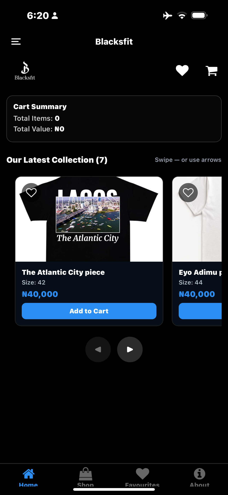
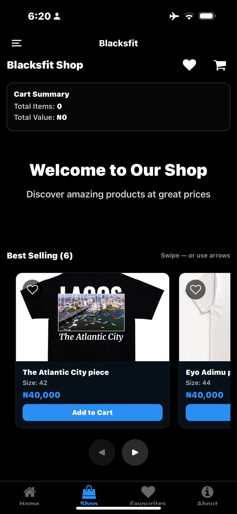
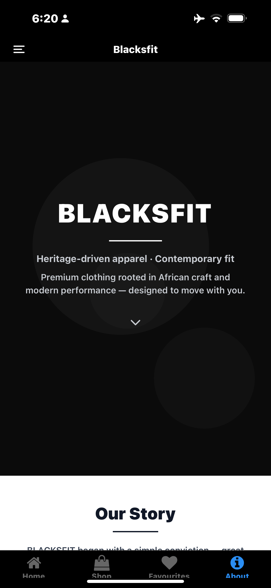
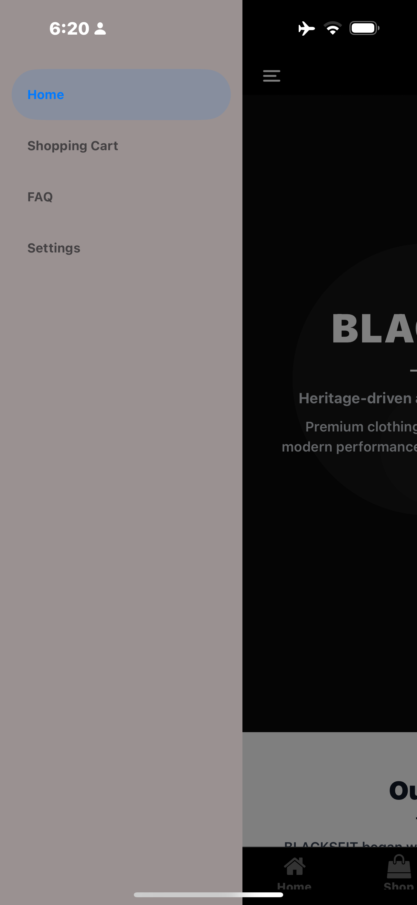

---

# MOBILE APP (REACT NATIVE + EXPO VERSION)

After completing the web version, BLACKSFIT was **rebuilt as a full mobile app** using **React Native + Expo**, giving users a native shopping experience on Android & iOS.
# NOTE
 I used **Zapier**C for the automation and authentication during testing, but the free trial has expired. If you install and run the app, you can find the authentication code in the console.
## Mobile App Features
-  **React Native + Expo build**  
-  **Same BLACKSFIT dark aesthetic**  
-  **Product listing & product detail screens**  
-  **Redux-powered Cart system**  
-  **Smooth navigation** with Expo Router / React Navigation  
-  **Optimized assets for mobile**  
-  **Upcoming: Mobile payments via Paystack + Flutterwave**  

---
## UI Preview

> A clean and elegant interface that showcases BLACKSFIT’s latest collection:


<table>
  <tr>
    <td></td>
    <td></td>
  </tr>
  <tr>
    <td></td>
    <td></td>
  </tr>
</table>

##  Tech Stack (Mobile)

| Tech | Purpose |
|------|---------|
| **React Native** | Mobile app development |
| **Expo** | Build & deployment |
| **TypeScript** | Strong typing |
| **Redux Toolkit** | Cart and global state |
| **Expo Router / React Navigation** | App navigation |
| **Expo Assets** | Fonts & images |

---

## 📂 Mobile App Folder Structure


---

# Payment Integration (Planned)

Will support:
- **Paystack**
- **Flutterwave**

Checkout Flow:
1. Add to Cart  
2. Review Items  
3. Checkout  
4. Choose Payment Method  
5. Complete Purchase  

---

# 📬 FAQ  
The web version includes a **FAQ Page**  that handles:
- Question 
- Answers 
- Message / Inquiry  

Integrated using **Formspree**.

---

# Installation & Setup

## mobile App Setup
```bash
git clone https://github.com/shittu-qudus/Blacksfit-APP.git
cd blacksfit
npm install
npx expo start

Author
Built by Shittu Qudus Adekunle
📍 Nigeria — Frontend Developer (React/Next.js)

LinkedIN- https://ng.linkedin.com/in/shittu-qudus-5787762ab

Portfolio- https://my-portofolio-4ssz.vercel.app/

GitHub- https://github.com/shittu-qudus

        ```
